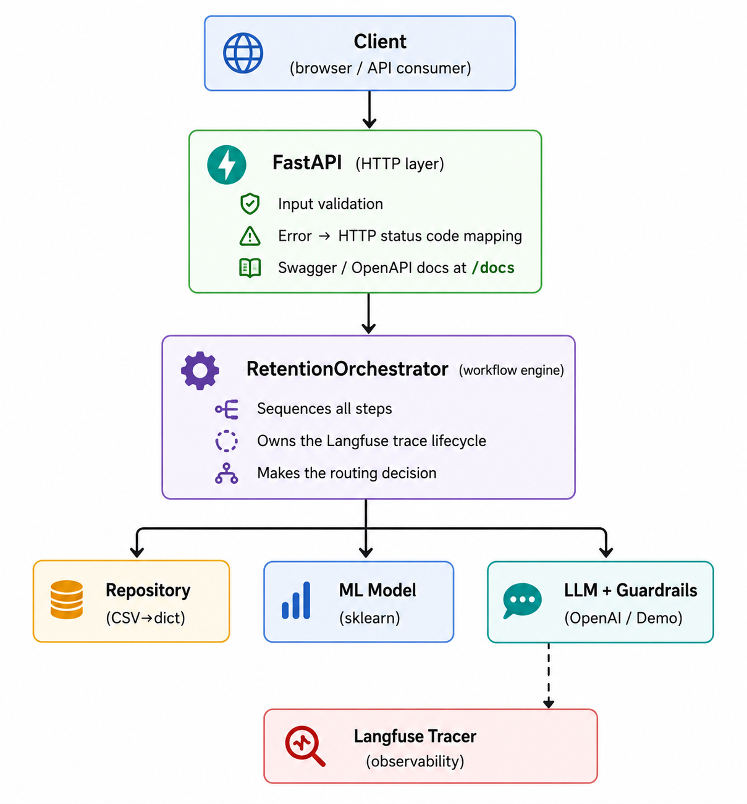
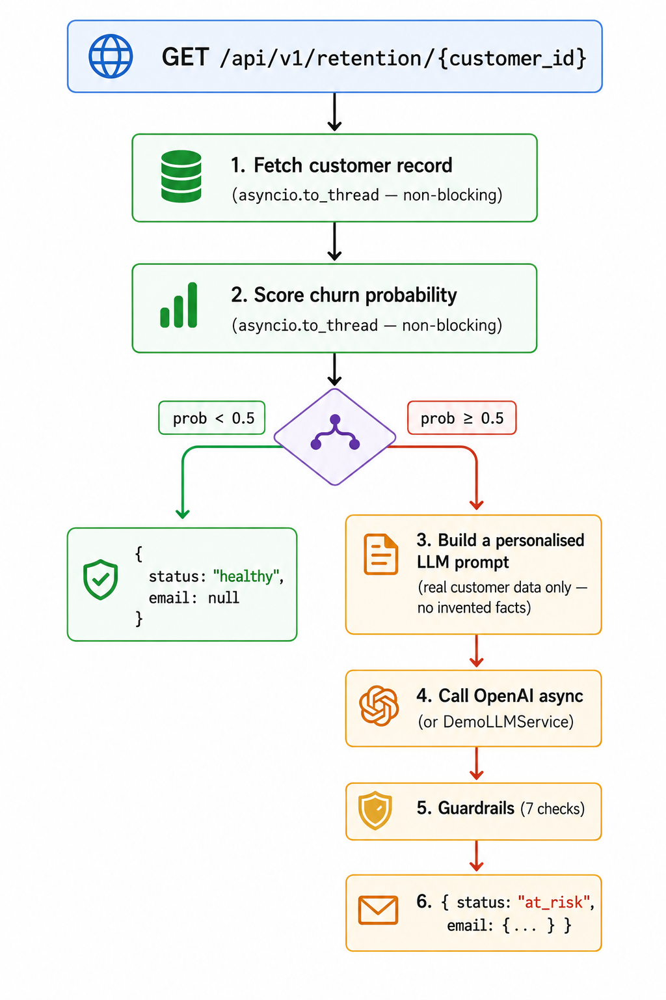
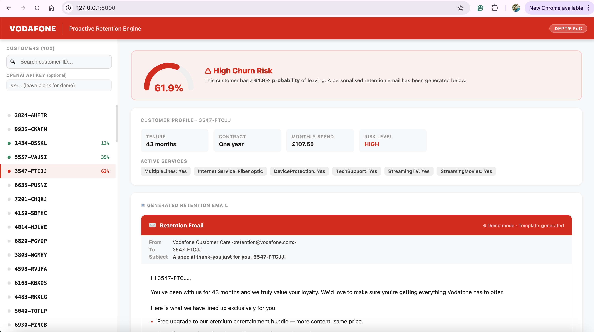
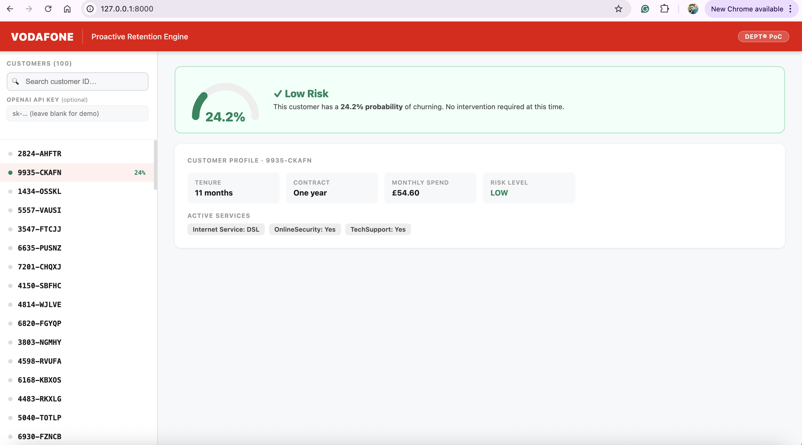
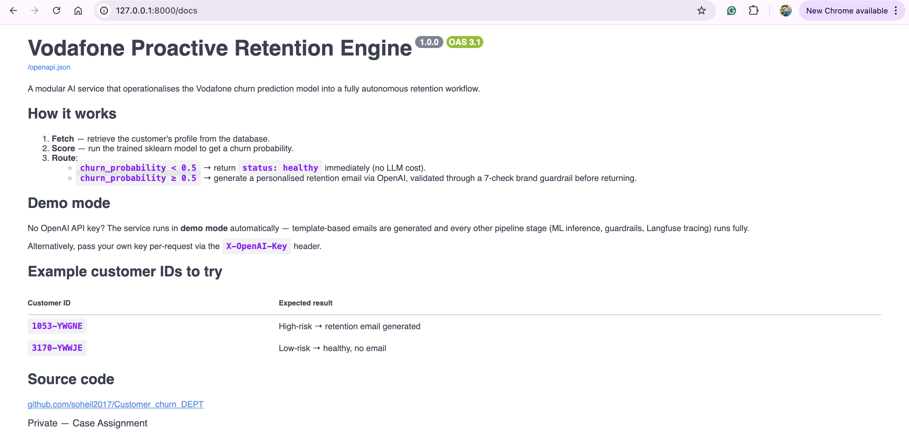
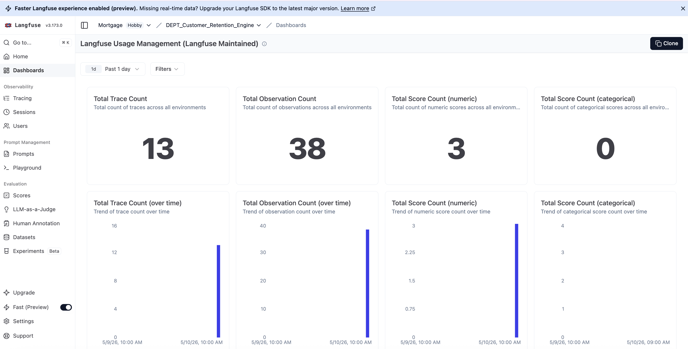
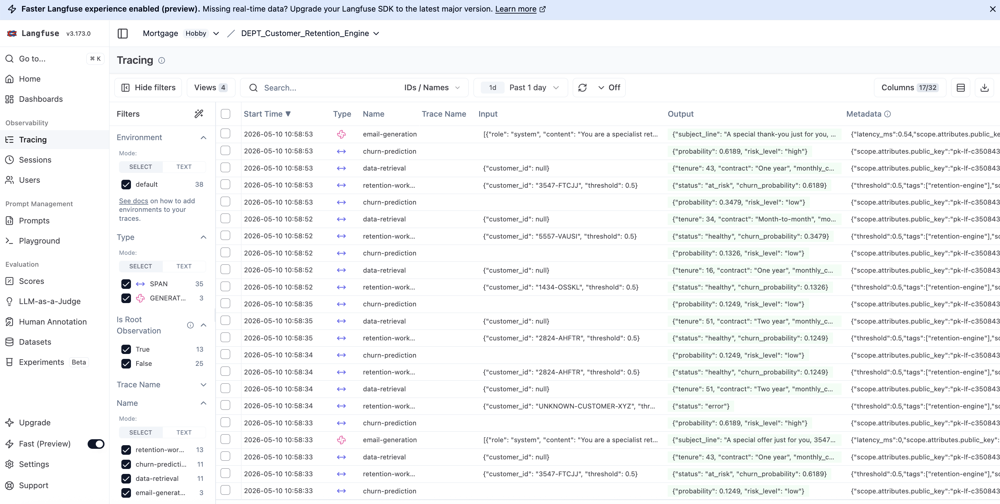

# Vodafone Proactive Retention Engine

A production-grade AI service that operationalises the Vodafone churn prediction model into a fully automated retention workflow, from predictive insight to personalised, brand-compliant action.

**Swagger docs:** `/docs`

---

## Problem Statement

Vodafone's Data Science team has a trained churn model. A model sitting in a notebook generates no business value. This service closes that gap:

- Score any customer's churn probability on demand via a REST API
- Route low-risk customers instantly; no unnecessary LLM cost
- For high-risk customers, generate a personalised, Vodafone brand-compliant retention email through a multi-layer guardrail pipeline
- Return structured, auditable responses ready for downstream CRM or campaign tooling

The result is a complete loop from raw customer data to a ready-to-send retention action; fully automated, observable, and extensible.

---

## Architecture

This is not a notebook or a monolithic script. Every concern is separated into its own layer:



### Layer responsibilities

| Layer | File | Single responsibility |
|-------|------|-----------------------|
| API routing | `app/api/v1/retention.py` | HTTP ↔ domain translation |
| Orchestration | `app/services/retention_orchestrator.py` | Workflow sequencing |
| Data access | `app/services/customer_repository.py` | Fetch customer record |
| ML inference | `app/services/churn_predictor.py` | Score churn probability |
| LLM generation | `app/services/llm_service.py` | Generate retention email |
| Guardrails | `app/services/guardrails.py` | Validate LLM output |
| Observability | `app/services/tracer.py` | Langfuse tracing |
| Config | `app/core/config.py` | Environment-based settings |
| Schemas | `app/schemas/retention.py` | Pydantic contracts |
| Exceptions | `app/core/exceptions.py` | Domain error hierarchy |

### SOLID principles in practice

**Single Responsibility** — each class owns exactly one concern. The orchestrator coordinates but never does I/O directly.

**Open/Closed** — swap any service by adding a class, not modifying existing ones:
```python
class PostgresCustomerRepository(CustomerRepositoryABC): ...  # drop-in replacement
class GeminiLLMService(LLMServiceABC): ...                    # swap LLM provider
```

**Dependency Inversion** — the orchestrator depends on abstract interfaces, never concrete classes:
```python
class RetentionOrchestrator:
    def __init__(
        self,
        repository:  CustomerRepositoryABC,   # ← interface
        predictor:   ChurnPredictorABC,        # ← interface
        llm_service: LLMServiceABC,            # ← interface
        guardrails:  GuardrailsABC,            # ← interface
    ): ...
```
FastAPI's `Depends()` injects concrete instances at runtime. Tests inject mocks. Same orchestrator, zero changes.

---

## Workflow



**High-risk customer — retention email generated:**



**Low-risk customer — healthy, no email:**



---

## Guardrails — Reliability & Safety

The guardrails layer runs **after** the LLM generates the email. All 7 checks must pass, or the email is rejected with `422`. It never reaches the caller.

| # | Check | Failure mode caught |
|---|-------|---------------------|
| 1 | Valid JSON | Model wraps output in prose or markdown fences |
| 2 | All 7 fields present | Model omits a section |
| 3 | Minimum field length | Trivially short or empty content |
| 4 | No `[Name]` placeholders | Un-substituted template variables |
| 5 | Customer ID in greeting | Wrong or generic personalisation |
| 6 | No prohibited language | `churn`, `cancel`, `termination`, negative adjectives |
| 7 | No competitor brands | EE, O2, Three, BT, Sky, Virgin Media |

`response_format: {"type": "json_object"}` is also enforced at the OpenAI API level — a structural safety net before the guardrail checks even run.

### Hallucination prevention — three layers

1. **Prompt grounding** — the user prompt supplies only verified facts from the customer's database record. The model cannot invent account details that were never given.
2. **Structured output** — `json_object` forces the model into 7 named fields with no room for free-form prose that bypasses the schema.
3. **Post-validation** — guardrail checks reject any output containing prohibited claims before it reaches the caller.

---

## Setup

```bash
git clone https://github.com/soheil2017/DEPT_Customer_Retention_Engine.git
cd DEPT_Customer_Retention_Engine/Retention_Engine
pip install -r requirements.txt
cp .env.example .env   # add your keys (all optional — see demo mode below)
uvicorn app.main:app --reload
```

- **UI** → http://localhost:8000
- **Swagger docs** → http://localhost:8000/docs
- **High-risk demo** → http://localhost:8000/api/v1/retention/1053-YWGNE
- **Low-risk demo** → http://localhost:8000/api/v1/retention/3170-YWWJE



### Environment variables

| Variable | Default | Description |
|----------|---------|-------------|
| `OPENAI_API_KEY` | *(optional)* | Leave blank to run in demo mode |
| `LLM_MODEL` | `gpt-4o-mini` | Swap to `gpt-4o` for higher quality |
| `CHURN_THRESHOLD` | `0.5` | Risk routing cutoff |
| `LANGFUSE_PUBLIC_KEY` | *(optional)* | Enables Langfuse tracing |
| `LANGFUSE_SECRET_KEY` | *(optional)* | Enables Langfuse tracing |
| `LANGFUSE_HOST` | `https://cloud.langfuse.com` | Langfuse server URL |

### Demo mode — intentional production design

The service runs without an OpenAI key. This is not a workaround. It is intentional production engineering:

| Mode | Condition | Email generation |
|------|-----------|-----------------|
| **Real LLM** | `OPENAI_API_KEY` set | GPT call via OpenAI |
| **Demo** | No key configured | Template-based, deterministic |

Every other stage (ML inference, guardrails, Langfuse tracing) runs identically in both modes. The response includes `"demo_mode": true/false` so callers know which mode was used.

Reviewers can also pass their own key per-request without touching server config:
```bash
curl http://localhost:8000/api/v1/retention/1053-YWGNE \
     -H "X-OpenAI-Key: sk-..."
```

---

## Trade-offs

| Decision | Why | What it costs |
|----------|-----|---------------|
| CSV as data store | Zero infrastructure for a PoC | Not suitable for production — swap `CSVCustomerRepository` for a Postgres implementation |
| All-or-nothing guardrails | Simple to reason about, easy to audit | A single bad field rejects the whole email — production would prefer field-level retry |
| DemoLLMService template | Reviewers can test without an API key | Less personalised than real GPT output |
| Data files committed to repo | Vercel bundling requires it | Not appropriate for large models or sensitive data |
| Synchronous sklearn inference | Simple, no extra infra | Offloaded to thread pool via `asyncio.to_thread` — acceptable at PoC scale |

---

## Scalability

All I/O is async — the event loop is never blocked:

```python
# Network I/O — native async
response = await openai_client.chat.completions.create(...)

# CPU / disk I/O — offloaded to thread pool
record     = await asyncio.to_thread(repository.get_customer, id)
churn_prob = await asyncio.to_thread(predictor.predict, record)
```

All heavy objects (model, CSV index, LLM client) are initialised **once at startup** via FastAPI's lifespan hook; zero per-request cold-start cost.

### Scaling beyond the PoC

| Bottleneck | Solution |
|------------|---------|
| CSV file | Drop-in swap to `PostgresCustomerRepository` (async, connection-pooled) |
| Re-scoring unchanged customers | Redis cache for churn scores with a TTL |
| Synchronous request processing | Queue-based architecture (Celery + Redis / AWS SQS) for batch retention campaigns |
| Single instance | Stateless design — run `uvicorn --workers 4` or deploy behind a load balancer |
| LLM cost at scale | Cache generated emails per customer segment; use `gpt-4o-mini` for generation, `gpt-4o` only for high-value segments |

---

## Observability & Monitoring

### Langfuse (implemented)

Every request produces a full trace in Langfuse using the **Langfuse SDK v4** (OpenTelemetry-based):

| Signal | What is captured |
|--------|-----------------|
| Trace | Customer ID, threshold, overall status |
| Span: data-retrieval | Tenure, contract, monthly charges |
| Span: churn-prediction | Probability, risk level |
| Generation: email-generation | Model, full prompt, completion, token counts, latency |
| Score: guardrail-compliance | 1.0 = pass, 0.0 = fail |
| Event: guardrail-violation | Exact violations for audit |

`flush()` is called synchronously at the end of every trace — critical in serverless (Vercel), where the process may freeze immediately after the HTTP response is sent.

When Langfuse keys are absent, `NoOpTracer` is injected — identical interface, zero overhead, zero errors.

**Langfuse observability dashboard:**



**Langfuse trace list:**



### Structured logging (implemented)

```
INFO  | retention_orchestrator | Customer 1053-YWGNE | prob=0.9372 | risk=high
INFO  | llm_service | LLM response | latency=1243ms | tokens in=412 out=289
WARN  | guardrails  | Guardrail violations detected: [...]
```

Ship to Datadog, Grafana Loki, or CloudWatch by adding a log handler — no code changes.

### Production monitoring roadmap

| Metric | Tool |
|--------|------|
| Request latency per endpoint | Prometheus + `starlette-prometheus` |
| LLM call duration & token cost | Langfuse generations |
| Churn score distribution | Histogram — detect model drift |
| Guardrail violation rate | Counter — alert if it spikes (LLM regression) |
| Distributed tracing | OpenTelemetry → `FastAPIInstrumentor.instrument_app(app)` |

---

## Tests

```bash
pytest tests/ -v   # 24 tests, no network or API calls required
```

| Module | Tests | What is verified |
|--------|-------|-----------------|
| `test_customer_repository` | 4 | CSV loading, lookup, 404, service parsing |
| `test_churn_predictor` | 3 | Probability range, type, all 100 customers scored |
| `test_guardrails` | 9 | Every rule in isolation — no LLM needed |
| `test_retention_api` | 8 | Full HTTP integration, healthy + at-risk paths |

The LLM is mocked in all tests. This proves the SOLID design is real — every dependency is genuinely injectable and replaceable without touching production code.

---

## Docker

```bash
cp .env.example .env
docker compose up --build       # hot-reload dev mode
```

```bash
docker build -t retention-engine.
docker run -p 8000:8000 --env-file .env retention-engine   # production build
```

Multi-stage build · non-root user · `/health` wired into Docker `HEALTHCHECK`.

---

## Deployment (Vercel)

1. Push to GitHub
2. Import at [vercel.com/new](https://vercel.com/new) · Set **Root Directory** → `Retention_Engine`
3. Add environment variables (all optional — service runs in demo mode without them)
4. Deploy

`vercel.json` routes all traffic to `api/index.py`, which re-exports the FastAPI app. The model and CSV (~19 KB) are bundled automatically.

The frontend is served directly by FastAPI at `/` — a single Vercel function handles everything. It is presented as a demo layer for business stakeholders and reviewers, not as the core deliverable. **The API service is the primary engineering artifact.**

---

## Future Improvements

- **Real offers catalogue** — ground the LLM prompt with approved offers so it selects rather than invents. Add an allowlist guardrail to enforce it.
- **Postgres + async ORM** — replace `CSVCustomerRepository` for production data volumes
- **Redis score cache** — skip re-scoring unchanged customers; include TTL and invalidation hook
- **Queue-based batch processing** — Celery + Redis for proactive daily retention campaigns across the full customer base
- **Retry on guardrail failure** — retry the LLM call once with an explicit correction instruction before returning 422
- **Rate limiting** — `slowapi` middleware to protect OpenAI spend per API key
- **Model registry** — load model from S3/GCS rather than committing pkl files to the repo
- **Multi-model routing** — use `gpt-4o-mini` for standard cases, `gpt-4o` for high-value customers (tenure > 24 months, spend > £100/month)
